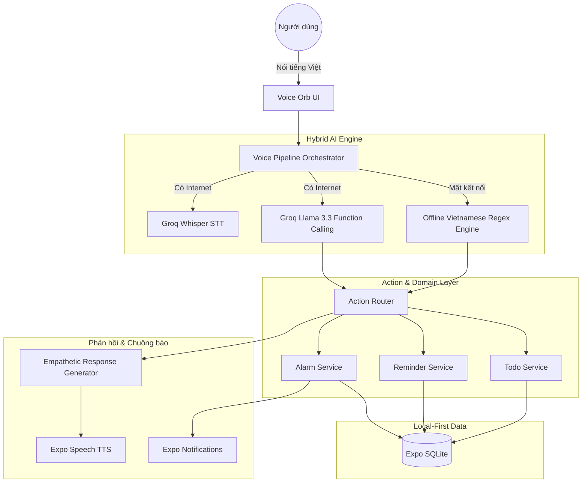

# 🎙️ VoiceAssist AI — Trợ lý Báo thức & Lời nhắc Thông minh Tiếng Việt

<p align="center">
  
  
  
  
  
</p>

---

## 🌟 Giới thiệu (Overview)

**VoiceAssist AI** là ứng dụng trợ lý giọng nói thông minh chuyên biệt cho việc quản lý **báo thức, lời nhắc và lịch trình cá nhân bằng Tiếng Việt**. 

Thay vì những tiếng chuông báo thức cơ học chói tai và giật mình, VoiceAssist AI mang đến trải nghiệm **đánh thức & nhắc nhở nhân ái (Empathetic & Ambient)**: giọng nói tự nhiên, lời chào buổi sáng tràn đầy năng lượng tích cực, cập nhật thời tiết và tóm tắt lịch trình ngay khi bạn thức giấc.

### Điểm nổi bật:
- 🗣️ **Xử lý giọng nói tiếng Việt tức thì**: Nhận dạng giọng nói (STT) siêu tốc qua Groq Whisper (~150ms) kết hợp giọng đọc thiết bị mượt mà qua `expo-speech`.
- 🧠 **AI Function Calling thông minh**: Sử dụng Groq LLM (`llama-3.3-70b` / `llama-3.1-8b`) tự động phân tích ý định, bóc tách thời gian tự nhiên (ví dụ: *"Nhắc tôi 20 phút nữa tắt bếp"* hoặc *"Đặt báo thức 6 rưỡi sáng mai"*).
- 📶 **Hoạt động Offline 100%**: Khi không có mạng, hệ thống tự động chuyển sang bộ tách lệnh ngữ nghĩa Tiếng Việt (Vietnamese Regex Rule Engine).
- 🎭 **3 Phong cách giọng điệu linh hoạt**: Tùy chọn Thân thiện (Friendly), Chuyên nghiệp (Professional) hoặc Dễ thương (Cute).
- 🌌 **Thiết kế Midnight Synapse cao cấp**: Giao diện OLED Dark Mode sang trọng, bảo vệ mắt ban đêm, quả cầu giọng nói **Voice Orb** sống động.

---

## 🏗️ Kiến trúc & Công nghệ (Tech Stack)



### Chi tiết Stack công nghệ:
- **Nền tảng**: React Native + Expo (TypeScript).
- **Quản lý trạng thái (State Management)**: Zustand.
- **Cơ sở dữ liệu**: `expo-sqlite` (Local-first, an toàn dữ liệu trên máy).
- **Âm thanh & Giọng nói**: `expo-av`, `expo-speech`, `@react-native-voice/voice`.
- **AI & Cloud Service**: Groq Cloud API (`llama-3.3-70b-versatile`, `whisper-large-v3`).
- **Thông báo & Chuông**: `expo-notifications`.
- **Bảo mật**: `expo-secure-store` mã hóa lưu trữ API key cục bộ.
- **Giao diện & Icon**: Theme **Midnight Synapse** (chi tiết tại [`DESIGN.md`](DESIGN.md)), `lucide-react-native`.

---

## 📁 Cấu trúc thư mục (Project Structure)

```
alarm-ai-assistance/
├── .agents/              # AI Agent Workflows & Skills
├── assets/               # Biểu tượng, fonts & hình ảnh
├── docs/                 # Kế hoạch và đặc tả chi tiết (Plan & Spec)
├── src/
│   ├── core/             # Cấu hình lõi, Theme tokens, Hằng số
│   │   ├── constants/    # Hằng số ứng dụng
│   │   ├── theme/        # Colors, Typography (Midnight Synapse)
│   │   └── utils/        # Bộ bóc tách thời gian Tiếng Việt
│   ├── data/             # Cơ sở dữ liệu SQLite & DAOs
│   │   ├── database.ts   # Khởi tạo DB SQLite
│   │   └── daos/         # AlarmDao, ReminderDao, TodoDao, LogDao
│   ├── domain/           # Models, Types, Enums & Interfaces
│   ├── features/         # Các Module tính năng (Feature-first)
│   │   ├── ai/           # Groq Client, Rule-based NLU, Template Engine
│   │   ├── alarm/        # Quản lý báo thức & màn hình reo chuông
│   │   ├── reminder/     # Quản lý lời nhắc hẹn giờ
│   │   ├── todo/         # Danh sách công việc cần làm
│   │   ├── voice/        # STT, TTS & Bộ điều phối Voice Pipeline
│   │   ├── home/         # Màn hình chính & Quả cầu Voice Orb
│   │   └── settings/     # Cài đặt Tone giọng, TTS, Groq API Key
│   └── shared/           # Thành phần dùng chung (Stores, UI Components)
├── .env                  # Cấu hình API Key (Groq)
├── DESIGN.md             # Đặc tả chi tiết Design System
├── package.json          # Danh sách dependencies
└── App.tsx               # Entry point ứng dụng
```

---

## 🚀 Cài đặt & Khởi chạy (Getting Started)

### 1. Yêu cầu môi trường
- **Node.js**: >= 18.x (khuyến nghị 20.x hoặc 22.x)
- **npm** hoặc **yarn / pnpm / bun**
- Thiết bị di động cài sẵn ứng dụng **Expo Go** (Android / iOS) hoặc máy ảo Android Studio / Xcode.

### 2. Cài đặt Dependencies
```bash
npm install
```

### 3. Cấu hình Groq API Key
Tạo file `.env` tại thư mục gốc của dự án:
```env
EXPO_PUBLIC_GROQ_API_KEY=gsk_your_groq_api_key_here
```
*(Bạn cũng có thể nhập hoặc thay đổi API key bất kỳ lúc nào trực tiếp trong màn hình **Cài đặt** của ứng dụng)*.

### 4. Khởi chạy ứng dụng
```bash
# Khởi động Expo Dev Server
npm start

# Hoặc chạy trực tiếp trên Android / iOS
npm run android
npm run ios
```
Quét mã QR hiển thị trên Terminal bằng camera điện thoại (iOS) hoặc ứng dụng **Expo Go** (Android) để trải nghiệm app ngay lập tức!

---

## 💡 Ví dụ câu lệnh mẫu (Sample Voice Commands)

| Bạn nói | Hệ thống xử lý | Hành động |
| :--- | :--- | :--- |
| *"Gọi tôi dậy lúc 6 giờ 30 sáng mai"* | Intent: `setAlarm`, Time: `06:30` | Tạo báo thức, bật âm thanh dịu nhẹ |
| *"Nhắc tôi 15 phút nữa kiểm tra nồi kho"* | Intent: `setReminder`, Duration: `15m` | Tạo bộ đếm đếm ngược, thông báo có chuông |
| *"Thêm vào danh sách mua sữa và bánh mì"* | Intent: `addTodo`, Items: `Mua sữa, bánh mì` | Lưu vào To-do list hôm nay |
| *"Hôm nay tôi có những lịch gì?"* | Intent: `querySchedule` | AI tổng hợp và đọc lịch trình bằng giọng nói |

---

## 📄 Bản quyền & Đóng góp (License & Contributing)
Dự án được xây dựng và phát triển mã nguồn mở. Mọi đóng góp và pull request đều được chào đón nồng nhiệt!
