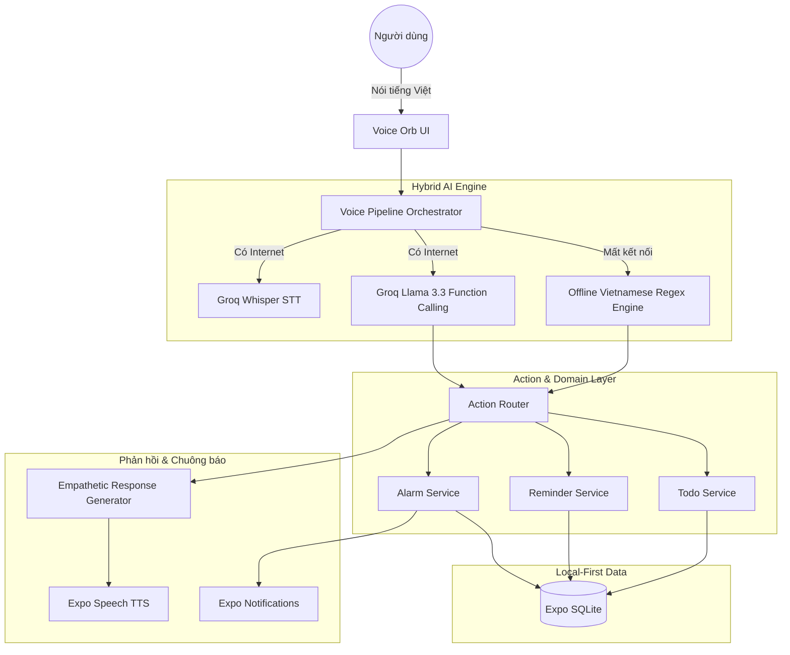

# 🎙️ VoiceAssist AI — Trợ lý Báo thức & Lời nhắc Thông minh Tiếng Việt

<p align="center">
  
  
  
  
  
</p>

---

## 🌟 Giới thiệu (Overview)

**VoiceAssist AI** là ứng dụng trợ lý giọng nói thông minh chuyên biệt cho việc quản lý **báo thức, lời nhắc hẹn giờ và danh sách công việc bằng Tiếng Việt**. 

Thay vì những tiếng chuông báo thức cơ học chói tai và giật mình, VoiceAssist AI mang đến trải nghiệm **đánh thức & nhắc nhở nhân ái (Empathetic & Ambient)**: giọng nói truyền cảm tự nhiên, lời chào buổi sáng tràn đầy năng lượng tích cực, cập nhật thời tiết và tóm tắt lịch trình ngay khi bạn thức giấc.

### ✨ Điểm nổi bật & Tính năng chính:
- 🗣️ **Xử lý giọng nói tiếng Việt siêu tốc**: Nhận dạng giọng nói (STT) qua Groq Whisper API (`whisper-large-v3`, ~150ms latency) kết hợp giọng đọc tiếng Việt mượt mà qua `expo-speech`.
- 🧠 **AI Function Calling thông minh**: Sử dụng Groq LLM (`llama-3.3-70b-versatile` / `llama-3.1-8b-instant`) tự động phân tích ý định, bóc tách thời gian tự nhiên (ví dụ: *"Nhắc tôi 20 phút nữa tắt bếp"* hoặc *"Đặt báo thức 6 rưỡi sáng mai"*).
- 💬 **Trợ lý Hội thoại & Tra cứu (AI Chat)**: Màn hình hội thoại hai chiều trực quan, hỗ trợ tương tác linh hoạt bằng cả văn bản và giọng nói.
- ⏰ **Bộ công cụ Quản lý Toàn diện (All-in-One Management)**:
  - **Báo thức (Alarms)**: Bật/tắt, lặp lại theo thứ trong tuần, tạo bằng giọng nói hoặc nhập tay.
  - **Lời nhắc (Reminders)**: Hẹn giờ đếm ngược thông minh, thông báo nhắc việc chính xác.
  - **Việc cần làm (To-Do List)**: Quản lý danh sách việc hôm nay, đánh dấu hoàn thành nhanh chóng.
- 🔔 **Chuông báo & Rung liên tục (Persistent Ringing & Test Center)**: Cơ chế reo chuông và rung chu kỳ liên tục cho đến khi người dùng tắt hoặc hoãn; tích hợp trung tâm kiểm thử tức thì (5s/10s) giúp trải nghiệm chuông báo và giọng đọc ngay lập tức.
- 📶 **Hoạt động Offline 100%**: Khi mất kết nối mạng, hệ thống tự động chuyển sang bộ bóc tách ngữ nghĩa Regex Tiếng Việt nội bộ (Vietnamese Rule-based NLU & Time Parser).
- 🎭 **3 Phong cách giọng điệu linh hoạt**: Tùy chọn Thân thiện (Friendly), Chuyên nghiệp (Professional) hoặc Dễ thương (Cute).
- 🌌 **Thiết kế Midnight Synapse cao cấp**: Giao diện OLED Dark Mode sang trọng, bảo vệ mắt ban đêm, quả cầu giọng nói **Voice Orb** sống động.

---

## 🏗️ Kiến trúc & Công nghệ (Tech Stack)


```mermaid
graph TD
  User((Người dùng)) -->|Nói tiếng Việt| VoiceOrb[Voice Orb UI]
  VoiceOrb --> VoicePipeline[Voice Pipeline Orchestrator]
  
  subgraph AI Engine [Hybrid AI Engine]
    VoicePipeline -->|Có Internet| GroqWhisper[Groq Whisper STT]
    VoicePipeline -->|Có Internet| GroqLLM[Groq Llama 3.3 Function Calling]
    VoicePipeline -->|Mất kết nối| RegexNLU[Offline Vietnamese Regex Engine]
  end

  subgraph Action Layer [Action & Domain Layer]
    GroqLLM --> ActionRouter[Action Router]
    RegexNLU --> ActionRouter
    ActionRouter --> AlarmService[Alarm Service]
    ActionRouter --> ReminderService[Reminder Service]
    ActionRouter --> TodoService[Todo Service]
  end

  subgraph Local Storage [Local-First Data]
    AlarmService --> SQLite[(Expo SQLite)]
    ReminderService --> SQLite
    TodoService --> SQLite
  end

  subgraph Response & Alert [Phản hồi & Chuông báo]
    ActionRouter --> ResponseGen[Empathetic Response Generator]
    ResponseGen --> ExpoSpeech[Expo Speech TTS]
    AlarmService --> NotifService[Expo Notifications]
  end
```

### Chi tiết Stack công nghệ:
- **Nền tảng**: React Native + Expo SDK (TypeScript Strict Mode).
- **Quản lý trạng thái (State Management)**: Zustand.
- **Cơ sở dữ liệu**: `expo-sqlite` (Kiến trúc Local-First, DAOs pattern, bảo mật dữ liệu trên máy).
- **Âm thanh & Giọng nói**: `expo-audio`, `expo-speech`, `expo-av`.
- **AI & Cloud Service**: Groq Cloud API (`llama-3.3-70b-versatile`, `whisper-large-v3`).
- **Thông báo & Chuông**: `expo-notifications` (Kênh thông báo mức ưu tiên cao `MAX`, rung chuỗi liên tục).
- **Bảo mật**: `expo-secure-store` mã hóa lưu trữ API key cục bộ.
- **Giao diện & Icon**: Midnight Synapse Design System (chi tiết tại [`DESIGN.md`](DESIGN.md)), `lucide-react-native`.

---

## 📁 Cấu trúc thư mục (Project Structure)

```
alarm-ai-assistance/
├── assets/               # Biểu tượng, fonts & hình ảnh
├── docs/                 # Kế hoạch và đặc tả chi tiết (Plan & Spec)
├── src/
│   ├── core/             # Cấu hình lõi, Theme tokens, Hằng số
│   │   ├── constants/    # Hằng số ứng dụng
│   │   ├── theme/        # Colors, Typography (Midnight Synapse)
│   │   └── utils/        # Bộ bóc tách thời gian Tiếng Việt (Vietnamese Time Parser)
│   ├── data/             # Cơ sở dữ liệu SQLite & DAOs
│   │   ├── database.ts   # Khởi tạo DB SQLite
│   │   └── daos/         # AlarmDao, ReminderDao, TodoDao, ConversationLogDao
│   ├── domain/           # Models, Types, Enums, Interfaces & Services
│   │   └── services/     # AlarmService, ReminderService, NotificationService,...
│   ├── features/         # Các Module tính năng (Feature-first)
│   │   ├── ai/           # Groq Client, Function Calling, Rule-based NLU, Template Engine
│   │   ├── alarm/        # Quản lý Báo thức, Lời nhắc, Việc cần làm & Màn hình chuông reo
│   │   ├── chat/         # Màn hình chat hội thoại AI thông minh
│   │   ├── home/         # Màn hình chính & Quả cầu tương tác Voice Orb
│   │   ├── voice/        # STT, TTS & Bộ điều phối Voice Pipeline
│   │   └── settings/     # Cài đặt Tone giọng, TTS, Quản lý Groq API Key
│   └── shared/           # Thành phần dùng chung (Stores, UI Components)
├── .env                  # Cấu hình API Key (Groq)
├── DESIGN.md             # Đặc tả chi tiết Design System
├── package.json          # Danh sách dependencies
└── App.tsx               # Entry point ứng dụng
```

---

## 🚀 Cài đặt & Khởi chạy (Getting Started)

### 1. Yêu cầu môi trường
- **Node.js**: >= 18.x (khuyến nghị 20.x hoặc 22.x LTS)
- **npm** hoặc **yarn / pnpm / bun**
- Thiết bị di động cài sẵn ứng dụng **Expo Go** (Android / iOS) hoặc máy ảo Android Studio / Xcode.

### 2. Cài đặt Dependencies
```bash
npm install
```

### 3. Cấu hình Groq API Key
Tạo file `.env` tại thư mục gốc của dự án:
```env
EXPO_PUBLIC_GROQ_API_KEY=gsk_your_groq_api_key_here
```
*(Bạn cũng có thể nhập hoặc thay đổi API key bất kỳ lúc nào trực tiếp trong tab **Cài đặt** của ứng dụng)*.

### 4. Khởi chạy ứng dụng
```bash
# Khởi động Expo Dev Server
npm start

# Hoặc chạy trực tiếp trên Android / iOS
npm run android
npm run ios
```
Quét mã QR hiển thị trên Terminal bằng camera điện thoại (iOS) hoặc ứng dụng **Expo Go** (Android) để trải nghiệm ứng dụng ngay lập tức!

---

## 💡 Ví dụ câu lệnh mẫu (Sample Voice Commands)

| Bạn nói | Hệ thống xử lý | Hành động thực hiện |
| :--- | :--- | :--- |
| *"Gọi tôi dậy lúc 6 giờ 30 sáng mai"* | Intent: `setAlarm`, Time: `06:30` | Tạo báo thức mới, kích hoạt chuông & lời chào buổi sáng |
| *"Nhắc tôi 15 phút nữa kiểm tra nồi kho"* | Intent: `setReminder`, Duration: `15m` | Lập lời nhắc hẹn giờ đếm ngược, rung và thông báo chuông |
| *"Thêm vào danh sách mua sữa và bánh mì"* | Intent: `addTodo`, Items: `Mua sữa, bánh mì` | Lưu công việc vào danh sách To-do hôm nay |
| *"Hôm nay tôi có những lịch trình gì?"* | Intent: `querySchedule` | Trợ lý AI tổng hợp và đọc lịch trình bằng giọng nói |
| *"Thời tiết sáng nay thế nào?"* | Intent: `chat` | Trợ lý phản hồi thông tin và trò chuyện trực tiếp |

---

## 🧪 Trung tâm Thử nghiệm (Test Center)

Ứng dụng tích hợp sẵn các công cụ kiểm thử tức thì trong màn hình **Lịch trình / Báo thức**:
- **Test Báo thức tức thì (5s)**: Tự động kích hoạt chuông báo thức toàn màn hình sau 5 giây để thử nghiệm âm thanh reo liên tục, chế độ rung và giọng đọc đánh thức buổi sáng.
- **Test Lời nhắc hẹn giờ (5s / 10s)**: Lập lịch thông báo nhắc việc tức thì để kiểm tra luồng thông báo của thiết bị.

---

## 🛡️ Quyền riêng tư & Bảo mật (Privacy & Security)

- **Local-First Storage**: Mọi dữ liệu về báo thức, lời nhắc và danh sách công việc đều được lưu trữ trực tiếp trên thiết bị của bạn bằng SQLite, không gửi dữ liệu cá nhân lên máy chủ trung gian.
- **Secure Key Storage**: API Key được lưu trữ mã hóa an toàn thông qua `expo-secure-store`.
- **Offline Fallback**: Ứng dụng vẫn hoạt động trơn tru ngay cả khi không có kết nối Internet nhờ bộ tách lệnh Tiếng Việt cục bộ.

---

## 📄 Bản quyền & Đóng góp (License & Contributing)

Dự án được xây dựng và phát triển mã nguồn mở. Mọi đóng góp và pull request đều được chào đón nồng nhiệt!
